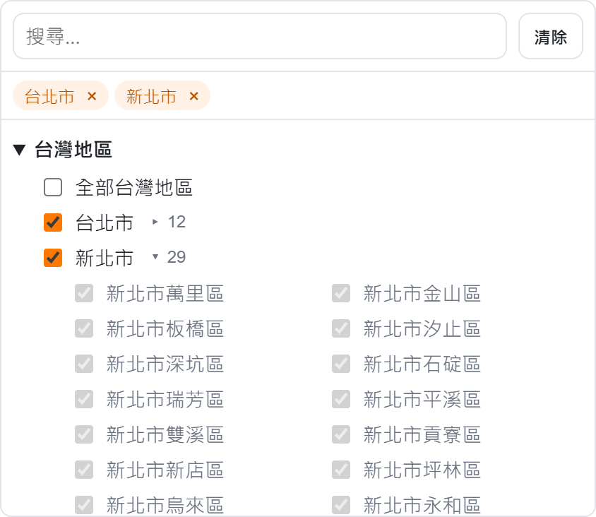
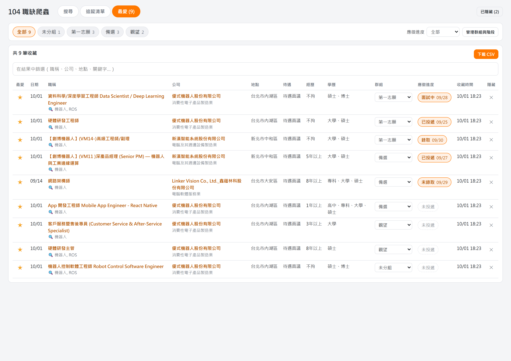

# 104 職缺爬蟲

在自己電腦上執行的 104 人力銀行找工作小工具：用網頁介面設定條件搜尋職缺、把常用的條件存成「追蹤」可進行重跑並自動標出新職缺，再用「最愛」整理想投的職缺、記錄應徵進度。

> [!WARNING]
> **免責聲明**
>
> - 本專案**非** 104 人力銀行官方工具，與一零四資訊科技股份有限公司無任何關係。
> - 僅供個人學習與研究使用。使用前請自行閱讀並遵守 [104 人力銀行](https://www.104.com.tw/)的使用條款。
> - 請勿高頻率或大量爬取，也請勿將取得的資料公開散布或用於商業用途。
> - 104 網站或 API 隨時可能變更，本專案不保證能持續正常運作。
> - 使用本專案所產生的一切後果，由使用者自行承擔。

**功能一覽**

- **搜尋**：多個關鍵字、地區（可選到鄉鎮區）、工作性質、更新時間（含自訂天數）、經驗、出勤、學歷、公司產業與類型，結果可排序、篩選、匯出 CSV
- **追蹤清單**：把搜尋條件存起來，之後一鍵重跑，自動標出「從沒看過」的新職缺；可一次「全部執行」
- **最愛**：收藏職缺、分群組、記錄應徵歷程（已投遞 → 面試中 → 錄取…，階段可自訂）
- **隱藏**：不想再看到的職缺，之後的搜尋與追蹤都會自動略過
- 所有資料存在自己電腦裡（`專案資料夾/data/history.db`），關掉網頁程式就自動結束

> 截圖中的職缺為 104 上的真實資料，群組、應徵進度與備註為示範內容。

---

## 目錄

1. [安裝（只需一次）](#1-安裝只需一次)
2. [日常使用](#2-日常使用)
3. [搜尋](#3-搜尋)
4. [追蹤清單](#4-追蹤清單)
5. [最愛與應徵進度](#5-最愛與應徵進度)
6. [隱藏職缺](#6-隱藏職缺)
7. [常見問題](#7-常見問題)
8. [檔案結構](#8-檔案結構)

---

## 1. 安裝（只需一次）

### 1-1. 安裝 Python
1. 確定已有安裝 python, 如無繼續往下
2. 到 [python.org](https://www.python.org/downloads/) 下載 Windows 版 Python（建議 3.11 以上，本專案以 3.14 開發與測試）。
3. 安裝時**務必勾選「Add python.exe to PATH」**。

### 1-2. 建立執行環境

在專案資料夾中**點兩下 `create_venv.bat`**。

它會：
- 建立 `.venv` 虛擬環境（專案專用的 Python 環境，不影響電腦上其他程式）
- 安裝需要的套件（`requests`、`pandas`、`flask`）

看到安裝完成、按任意鍵關閉即可。之後不需要再執行，除非刪除了 `.venv` 資料夾。

---

## 2. 日常使用

### 啟動

**點兩下 `start_ui.bat`**，瀏覽器會自動開啟 `http://127.0.0.1:5104`。

黑色視窗是程式本體，使用期間請不要關掉它。

### 結束

**直接關掉網頁即可**，約 5 秒後黑色視窗會自動關閉。

- 按 F5 重新整理不會讓程式結束
- 爬蟲執行中關閉網頁，瀏覽器會先詢問「確定要離開嗎？」；確定離開的話，爬蟲停在目前進度（已抓到的追蹤結果會保留）後結束
- 分頁放在背景、被瀏覽器休眠都不會讓程式結束；只有瀏覽器當掉時，黑色視窗不會自動關閉，手動關掉即可

### 出現「104爬蟲已經在執行中」

代表已經有一個 `start_ui.bat` 視窗開著（可能被縮到最小）。程式會自動幫你開啟瀏覽器連到正在執行的那個，不需要再開第二個。

### 資料存在哪裡

所有追蹤、執行紀錄、最愛、應徵進度與隱藏清單都存在 **`專案資料夾/data/history.db`**。

---

## 3. 搜尋

搜尋條件沿用 104網頁版選項

### 3-1. 關鍵字

- 輸入關鍵字後按 **Enter** 或**逗號**，就會變成一個標籤；可以加入多個
- **多個關鍵字會分別搜尋、合併結果並去除重複**（不是「同時包含」）。同一個職缺被多個關鍵字搜到時，只會出現一次，並標示是哪些關鍵字搜到的
- 不填關鍵字也可以，只用其他條件搜尋
- **排序**：「符合度」或「最近更新」

### 3-2. 地區

- 勾選縣市；點縣市旁的 **▸ 數字** 可以展開，選到鄉鎮區
- 勾了縣市後，底下的鄉鎮區會自動視為全選（灰色）
- 上方搜尋框可以直接打字找，例如「板橋」
- 不選 = 全部地區

### 3-3. 工作要求

| 條件 | 說明 |
|---|---|
| 工作性質 | 全部／全職／兼職／高階／派遣 |
| 更新時間 | 本日最新、三日內、一週內、二週內、一個月內，或選「**自訂**」輸入「最近 N 天內更新」 |
| 經驗 | 可複選：1 年以下、1-3 年、3-5 年、5-10 年、10 年以上 |
| 出勤規則 | 上班時段（日班／晚班／大夜班／假日班）、輪班、週休二日、一頭班 |
| 學歷要求 | 大學以上／碩士以上／博士以上 |

> **「大學以上」的意思**：職缺的**最低**學歷要求是大學或更高，所以會排除「學歷不拘」的職缺。
>
> **自訂天數**：104 只接受 0／3／7／14／30 天，自訂天數時程式會先用最接近的選項查詢，再依更新日期自行過濾。搭配「最近更新」排序時，翻到超過天數的頁面就會提前結束，比較省時間。

### 3-4. 公司相關

- **公司產業**：用法同地區，可展開到細項，也可搜尋
- **公司類型**：上市上櫃、外商一般、外商資訊

### 3-5. 執行設定

- **每個關鍵字最多爬幾頁**：每頁約 20 筆，104 最多提供 150 頁
- **抓取詳細資料**：勾選時會進每個職缺抓職務類別、擅長工具、其他條件等，每筆間隔 3 秒，比較慢；不勾選只抓列表，速度快很多
- 下方會顯示預估時間

設定好後按 **開始搜尋**。條件會自動記住，下次打開還在；按「清除條件」可以全部重設。

### 3-6. 結果

**進度面板**

- 顯示 104 符合筆數、頁數進度、已取得筆數、因條件略過的筆數
- 結束後會寫出**結束原因**，例如「已爬完設定的 1 頁」「104 符合條件的職缺只有 2 頁」
- 執行中可以按 **停止**；**下載 CSV** 匯出結果（Excel 可直接開啟）

**結果表格**

| 操作 | 說明 |
|---|---|
| 點「日期」「公司」標題 | 排序（再點一次反向，第三次恢復原順序） |
| 上方篩選框 | 在結果中找職稱、公司、地點、關鍵字 |
| 點職稱／公司 | 開啟 104 的職缺／公司頁面 |
| ☆ | 加入最愛（見[第 5 節](#5-最愛與應徵進度)） |
| ✕ | 隱藏職缺（見[第 6 節](#6-隱藏職缺)） |

> 一般搜尋的結果**不會存起來**，關掉就沒了。想保留的話：把條件「存成追蹤」後執行，或把職缺加入最愛。

---

## 4. 追蹤清單

追蹤 = 一組存起來的搜尋條件。之後每次執行，都會和**這個追蹤過去所有的結果**比對，從來沒出現過的職缺會標上 **「新」**。

### 4-1. 建立追蹤

在「搜尋」分頁設定好條件，按 **存成追蹤**，輸入名稱即可（頁數、是否抓詳細資料也會一起存）。

### 4-2. 執行與查看結果

- **左側卡片**：每個追蹤的條件摘要、上次執行時間，以及上次新增幾筆（橘色 **+N**）
- 按卡片上的 **執行** 開始
- **右側**：該追蹤的所有執行紀錄；點任一次可查看當次結果
  - 新職缺排在最前面並標上「新」
  - **只看新增**：只顯示新職缺
  - **下載 CSV**：多一欄 `isNew`
- 第一次執行時，所有職缺都算新增（畫面會註明「首次執行」）

### 4-3. 全部執行

按左上角 **全部執行**，會依清單由上到下，一個接一個執行所有追蹤。

- 執行中會顯示「全部執行 1/3：追蹤名稱」與目前追蹤的進度
- 按 **停止** 會停在目前進度，後面的追蹤不再執行
- 某個追蹤出錯（例如 104 拒絕請求）會記為「錯誤」並繼續下一個

完成後會出現總結，點任一列可以跳到該追蹤這次的結果：

### 4-4. 編輯、改名、複製、刪除

- **編輯條件**：切到搜尋頁並帶入條件，上方可以**修改名稱**，改完按「更新追蹤」
- **複製**：帶入同樣的條件，名稱預設「原名稱 的副本」，修改後按「儲存為新追蹤」。適合「條件差不多、換個地區」的情況。按「取消」不會產生任何追蹤
- **刪除**：會連同所有執行紀錄一起刪除（會先確認）
- 修改條件後，「看過的職缺」紀錄會保留；複製出來的新追蹤則從頭開始

---

## 5. 最愛與應徵進度

在任何結果表格點職缺前面的 **☆** 就會加入最愛（變成 ★），再點一次取消。最愛會保存收藏當下的完整資料，之後就算搜不到這個職缺也還看得到；再次被搜到時會自動更新資料（例如待遇有改）。

### 5-1. 群組

- 目前僅支援一個職缺放到一個群組, 1對1
- 每列的 **群組** 下拉選單直接切換；選「＋新增群組…」可以當場建立新群組
- 上方按鈕可以只看某個群組（旁邊數字是筆數）

### 5-2. 應徵進度

點每列的 **應徵進度**（例如「未投遞」或「面試中 09/28」）開啟進度視窗：

- 上方是應徵歷程（依日期排列），每筆可刪除
- 下方新增一筆：選階段、日期（預設今天，可以補記過去的日期）、備註
- 階段會預設選「目前階段的下一個」，所以通常直接按「新增」就好
- 表格上顯示的是**日期最新的那一筆**；沒有任何紀錄就是「未投遞」
- 上方「應徵進度」下拉可以只看某個階段或未投遞的職缺

### 5-3. 管理群組與階段

- 新增、改名、用 ↑ ↓ 調整順序、刪除
- 預設階段：已投遞、面試中、錄取、未錄取，可以自由增減（例如加「筆試」）
- 刪除群組：裡面的職缺變成「未分組」
- 刪除階段：用到它的歷程紀錄會保留，並顯示原本的名稱
- 改階段名稱：歷程會跟著顯示新名稱

### 5-4. 移出最愛

- 沒有應徵紀錄的職缺：直接取消，下方提示可以按「復原」
- **有應徵紀錄的職缺**：會先確認，因為群組與應徵紀錄會一起刪除；按「復原」可以完整還原（含原本的收藏時間）

### 5-5. 匯出

**下載 CSV** 會多出：群組、目前階段、階段日期、完整歷程（例如 `09/19 已投遞；09/23 面試中（線上筆試）`）、收藏時間。

---

## 6. 隱藏職缺

不想再看到的職缺，按該列最右邊的 **✕**。

- 隱藏後立刻消失，下方提示可以按「復原」
- **之後的一般搜尋與所有追蹤都會直接略過它**：不抓詳細資料、不算新增、CSV 也不會出現
- 隱藏和最愛互斥：隱藏一個已收藏的職缺會先確認，並一併移出最愛

點右上角 **已隱藏 (N)** 可以查看清單、恢復：

---

## 7. 常見問題

**Q：設定爬 5 頁，結果好像只有一頁的量？**
看進度面板的結束原因與「頁數進度（設定 5 頁，104 共 N 頁）」：
- 104 本身只有 1 頁結果
- 「條件不符略過」很多
- 自訂天數＋最近更新排序

**Q：關掉程式後，追蹤要重新執行才看得到結果嗎？**
- 不用。追蹤每次的結果都存在資料庫，打開「追蹤清單」就會顯示最近一次的結果；只有想抓最新職缺時才需要按「執行」。

**Q：搜尋失敗，出現「104拒絕請求」或抓不到資料？**
- 104 改版或調整 API 時可能發生。錯誤訊息會顯示在進度面板，也可以點開「執行紀錄」看詳細內容。

---

## 8. 檔案結構

| 檔案 | 說明 |
|---|---|
| `create_venv.bat` | 建立虛擬環境並安裝套件（第一次使用時執行） |
| `start_ui.bat` | 啟動程式並開啟瀏覽器 |
| `enter_venv.bat` | 開一個已啟用虛擬環境的命令列視窗（開發用） |
| `app.py` | 網頁伺服器與 API（Flask） |
| `crawler.py` | 104 爬蟲核心：搜尋、詳細資料、篩選、多關鍵字合併 |
| `watcher.py` | 執行追蹤、全部執行 |
| `storage.py` | 資料庫（SQLite）：追蹤、執行紀錄、最愛、應徵進度、隱藏 |
| `lifecycle.py` | 偵測網頁是否都已關閉，自動結束程式 |
| `static/` | 網頁介面（HTML／CSS／JavaScript） |
| `data/history.db` | 你的資料（自動建立，已排除在 git 之外） |
| `docs/screenshots.py` | 產生本文件截圖的腳本（使用示範資料與 Playwright，說明見檔案開頭） |

**啟動參數**（`app.py`）：`--no-browser` 不自動開瀏覽器、`--keep-alive` 網頁關閉後不自動結束、`--port N` 改用其他埠。

---

## 致謝

本專案最初改寫自 [SuYenTing/Python-web-crawler](https://github.com/SuYenTing/Python-web-crawler) 的 104 人力銀行爬蟲，CSV 欄位命名與連線重試的做法沿用自原作。
